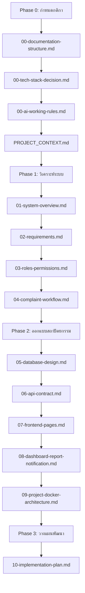

# Documentation Structure: โครงสร้างเอกสารและไฟล์ Planning

เอกสารฉบับนี้กำหนดโครงสร้างและลำดับความสัมพันธ์ของเอกสารทั้งหมดในโครงการพัฒนา **ระบบจองโต๊ะโรงอาหารในสถานศึกษา** เพื่อเป็นกรอบแนวทางสำหรับผู้พัฒนาและ AI ในการอัปเดตและใช้อ้างอิงข้อมูลระหว่างพัฒนา

---

## 1. โครงสร้างโฟลเดอร์ docs/
โฟลเดอร์หลักสำหรับเอกสารการวางแผนและการดูแลรักษาระบบ (Root Documentation Folder) ถูกจัดสรรแบ่งกลุ่มตามจุดประสงค์ของเอกสารดังนี้:
```text
docs/
├── planning/          # เอกสารการวิเคราะห์ ออกแบบ และวางแผนสถาปัตยกรรม (Planning & Design Docs)
├── testing/           # คู่มือและรายงานการทดสอบระบบ (Test Cases, QA Plans)
└── deployment/        # คู่มือการติดตั้งและติดตั้งระบบขึ้น Production (Operations & Deployment Guide)
```

## 2. โครงสร้าง docs/planning/
จัดกลุ่มเอกสารเริ่มต้นเพื่อปูพื้นฐานความเข้าใจทางสถาปัตยกรรม และวิเคราะห์ความต้องการเชิงระบบ:
```text
docs/planning/
├── 00-documentation-structure.md       # โครงสร้างเอกสารและไฟล์ระบบ (เอกสารนี้)
├── 00-tech-stack-decision.md           # ข้อตกลงเลือกใช้และจำกัดขอบเขตเทคโนโลยี
├── 00-ai-working-rules.md               # กติกาและข้อบังคับการรันงานร่วมกับ AI
├── 01-system-overview.md               # ภาพรวมระบบหลักและสถาปัตยกรรมภาพรวม
├── 02-requirements.md                  # การวิเคราะห์ความต้องการเชิงฟังก์ชันและเชิงระบบ
├── 03-roles-permissions.md             # โครงสร้างบทบาทสิทธิ์และสิทธิ์การเข้าถึงข้อมูล
├── 04-complaint-workflow.md            # ขั้นตอนกระบวนการทำงานหลัก (เช่น การเคลม/แจ้งร้องเรียน/จอง)
├── 05-database-design.md               # การออกแบบฐานข้อมูล ER-Diagram, Data Dictionary
├── 06-api-contract.md                  # สัญญาการส่งข้อมูล API endpoints & schema
├── 07-frontend-pages.md                # การออกแบบหน้าจอและ UI/UX structure
├── 08-dashboard-report-notification.md  # รายละเอียดสรุปบอร์ดรายงานและการแจ้งเตือน
├── 09-project-docker-architecture.md    # รายละเอียดสถาปัตยกรรม Network และ Container
├── PROJECT_CONTEXT.md                  # ข้อมูลภาพรวมและบริบทหลักของโปรเจกต์ (สำหรับโหลดความจำ AI)
└── 10-implementation-plan.md           # แผนงานการลงมือโค้ดแบ่งราย Phase
```

## 3. โครงสร้าง docs/testing/
เก็บเอกสารตรวจสอบความถูกต้องและความพร้อมของซอฟต์แวร์:
```text
docs/testing/
├── 01-manual-test-cases.md             # รายการเคสสำหรับใช้คนทดสอบระบบแมนนวล
├── 02-integration-testing-guide.md     # คู่มือทดสอบการทำงานเชื่อมโยงกันของจุดสัมผัสต่าง ๆ
└── 03-qa-report-template.md            # แม่แบบรายงานสรุปคุณภาพของโปรเจกต์
```

## 4. โครงสร้าง docs/deployment/
เก็บเอกสารเกี่ยวกับการนำระบบขึ้นบริการและการบำรุงรักษา:
```text
docs/deployment/
├── 01-railway-deployment-guide.md      # คู่มือและขั้นตอนนำระบบขึ้น Railway Platform
└── 02-local-migration-guide.md         # คู่มือเตรียมย้ายฐานข้อมูลและเริ่มต้นระบบฝั่ง Local
```

## 5. รายชื่อไฟล์ Planning ที่ต้องสร้าง และวัตถุประสงค์
นี่คือรายละเอียดวัตถุประสงค์ของเอกสารในโฟลเดอร์ `docs/planning/`:

| ลำดับไฟล์ | ชื่อไฟล์ | วัตถุประสงค์ |
| :---: | :--- | :--- |
| 1 | `00-documentation-structure.md` | จัดระเบียบการตั้งชื่อ ลำดับการสร้าง และขอบเขตของโฟลเดอร์เอกสารทั้งหมด |
| 2 | `00-tech-stack-decision.md` | กำหนดขอบเขตเทคโนโลยี พอร์ตเน็ตเวิร์ก ข้อควรระวังของ Local & Production |
| 3 | `00-ai-working-rules.md` | กำหนดกฎความเงียบสงบ ข้อบังคับการ Commit และกระบวนการเขียนโค้ดของ AI |
| 4 | `PROJECT_CONTEXT.md` | บันทึกประวัติศาสตร์โปรเจกต์ ข้อมูลติดต่อ ข้อมูลสถาปัตยกรรม และบริบทเริ่มต้นที่ AI ต้องจดจำ |
| 5 | `01-system-overview.md` | แสดงบล็อกไดอะแกรมของระบบ ความสัมพันธ์ทางเน็ตเวิร์ก และ data flow รวมของแอปพลิเคชัน |
| 6 | `02-requirements.md` | รวบรวม User Story, Functional Requirements และ Non-Functional Requirements |
| 7 | `03-roles-permissions.md` | กำหนดสิทธิ์ของผู้ใช้งานในระบบ (เช่น นักเรียน, ผู้ดูแลระบบ, ร้านค้า) |
| 8 | `04-complaint-workflow.md` | แสดง Flow Diagram และสถานะของกระบวนการหลัก (เช่น สถานะการร้องเรียน/แจ้งปัญหาการจอง) |
| 9 | `05-database-design.md` | บันทึกโครงสร้างเทเบิล คีย์หลัก/คีย์นอก และ DDL script เริ่มต้น |
| 10 | `06-api-contract.md` | แสดงสเปกของ API, URL path, Method, Request/Response Payload |
| 11 | `07-frontend-pages.md` | แสดงรายการคอมโพเนนต์และเส้นทางของหน้าเว็บ (Routing) และ wireframes |
| 12 | `08-dashboard-report-notification.md`| ออกแบบเนื้อหาที่แสดงบนแดชบอร์ด ระบบพิมพ์รายงาน และการแจ้งเตือนแบบ Real-time |
| 13 | `09-project-docker-architecture.md` | รายละเอียด configurations ใน docker-compose, binds mount, volumes |
| 14 | `10-implementation-plan.md` | กำหนดรายการ Tasks และ Milestone ของแต่ละ Phase ในการเขียนโค้ดจริง |

## 6. ลำดับการสร้างไฟล์ (Sequence of Creation)
เพื่อป้องกันการออกทะเลของโปรเจกต์และทำให้การวิเคราะห์เป็นไปในทิศทางเดียวกัน ให้สร้างและเซ็นอนุมัติเอกสารตามลำดับต่อไปนี้:


## 7. กติกาการตั้งชื่อไฟล์ (Naming Conventions)
* **รูปแบบหลัก:** `[ลำดับสองหลัก]-[คำอธิบายแบบสั้นขั้นด้วยขีด].md`
* **ตัวอักษร:** ใช้ตัวพิมพ์เล็กภาษาอังกฤษทั้งหมด (Lowercase) และหลีกเลี่ยงช่องว่าง (Spaces)
* **ข้อยกเว้น:** ไฟล์บริบทหลักระดับ Root ของโฟลเดอร์ให้ใช้ตัวพิมพ์ใหญ่ทั้งหมด (เช่น `PROJECT_CONTEXT.md`) เพื่อให้มองเห็นและหยิบมาอ่านได้ง่าย

## 8. กติกาการเขียน Markdown
* **Heading Hierarchy:** หน้าเว็บต้องมี Heading 1 (`#`) เพียงจุดเดียวเพื่อบอกชื่อเอกสาร และตามด้วย Heading 2 (`##`), Heading 3 (`###`) ตามโครงสร้างความสำคัญของข้อมูล
* **Links:** เมื่อเขียนระบุถึงไฟล์อื่น ต้องใช้ Markdown link ด้วย scheme `file://` เสมอ ห้ามเขียนข้อความลอย ๆ
* **Data presentation:** หลีกเลี่ยงย่อหน้าทึบ ๆ ยาว ๆ ให้ใช้ Bullet points และตาราง (Markdown Tables) เพื่อความชัดเจนในการนำเสนอ
* **Code blocks:** เมื่ออ้างอิงโค้ดตัวอย่าง ให้กำหนดชื่อภาษาใน block ทุกครั้ง (เช่น ` ```javascript ` หรือ ` ```sql `)

## 9. วิธีใช้เอกสารเหล่านี้กับ AI ในแต่ละ Phase
1. **การเริ่มต้น Turn ทำงาน:** AI ต้องโหลดและอ่าน `SKILL.md` และ `PROJECT_CONTEXT.md` เป็นอันดับแรกเพื่อรับทราบกติกาและขอบเขต
2. **ขั้นตอนการออกแบบฐานข้อมูลหรือ API:** AI ต้องเปิดอ่านและทำการอัปเดตไฟล์ `05-database-design.md` และ `06-api-contract.md` เสมอเพื่อตรวจสอบและลงข้อมูลให้ถูกต้องตามโครงสร้าง
3. **ก่อนเขียนโค้ด:** AI จะต้องอ่าน `10-implementation-plan.md` เพื่อดูว่าเฟสนี้ทำอะไร ขอบเขตอยู่ตรงไหน รันและทดสอบอย่างไร และทำเช็คลิสต์ตรวจสอบความสำเร็จตามแผนของตัวชี้วัด
4. **เมื่อเสร็จสิ้นการเขียนโค้ด:** AI จะต้องรายงานสรุปความคืบหน้าให้สอดคล้องกับหัวข้อที่ตกลงไว้ในกติกาความร่วมมือของโครงการ
