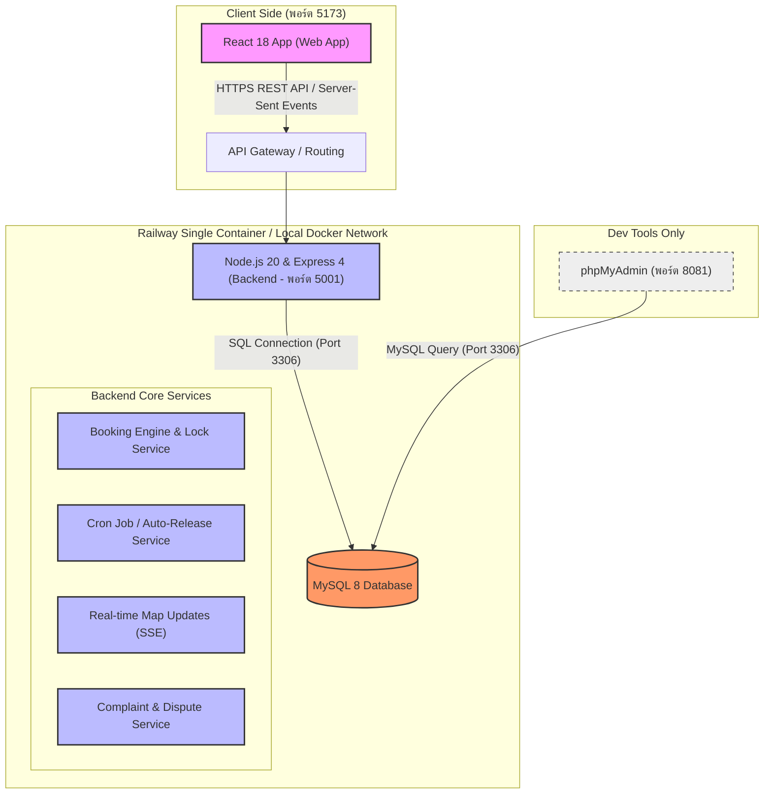
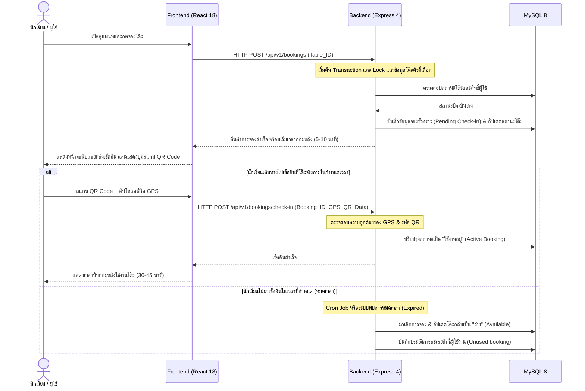
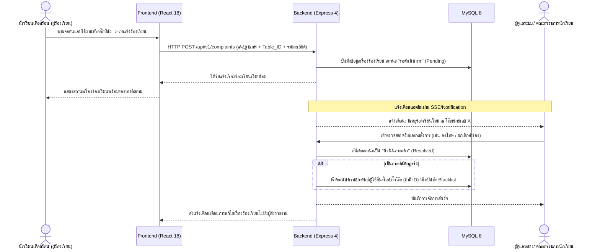

# ภาพรวมระบบหลักและสถาปัตยกรรมระบบ (System Overview)

เอกสารฉบับนี้จัดทำขึ้นโดย Senior Full-stack Software Architect, Business Analyst และ Project Manager เพื่อนำเสนอภาพรวมเชิงวิเคราะห์ การออกแบบสถาปัตยกรรม ความท้าทายหลักทางเทคนิค และโมดูลการทำงานต่าง ๆ ของ **ระบบจองโต๊ะโรงอาหารในสถานศึกษา (Canteen Table Booking System)** 

---

## 1. วัตถุประสงค์และเป้าหมายของระบบ (System Goal)

ระบบจองโต๊ะโรงอาหารในสถานศึกษาพัฒนาขึ้นเพื่อแก้ปัญหาหลัก ๆ ในโรงอาหารช่วงเวลาเร่งด่วน (พักกลางวัน) ดังนี้:
1. **ลดความแออัด (Congestion Mitigation):** ช่วยให้นักศึกษาและบุคลากรวางแผนเวลาในการรับประทานอาหารล่วงหน้าผ่านการจองคิวโต๊ะ
2. **จัดการการใช้งานอย่างทั่วถึง (Optimized Utility):** ลดการยืนรอและเดินหาโต๊ะว่างโดยไม่ทราบสถานะจริง
3. **แก้ปัญหากระทำผิดกฎกติกาการกั๊กที่นั่ง (Anti-Squatting System):** มีกลไกทางเทคโนโลยีและกฎเชิงพฤติกรรมควบคุมการจองและการใช้งานจริง
4. **ตรวจสอบและบริหารจัดการโรงอาหาร (Canteen Management):** มี Dashboard สำหรับผู้จัดการโรงอาหารหรือเจ้าหน้าที่สถานศึกษาเพื่อติดตามการจราจรและปัญหาภายในโรงอาหารอย่างมีประสิทธิภาพ

---

## 2. สถาปัตยกรรมระบบภาพรวม (System Architecture)

ระบบถูกออกแบบภายใต้สถาปัตยกรรม **Client-Server** โดยจัดกลุ่มระบบออกเป็นบริการต่าง ๆ ผ่าน Docker Container (ในขั้นตอนพัฒนา) และจะถูกรวมเป็น Single-container (Multi-stage Build) เมื่อ Deploy ขึ้นสู่ระบบคลาวด์ของ Railway ตามที่กำหนดไว้ใน [00-tech-stack-decision.md](file:///d:/Table-Booking-System/docs/planning/00-tech-stack-decision.md)

### 2.1 บล็อกไดอะแกรมสถาปัตยกรรม (System Component Map)



### 2.2 การสื่อสารทางเครือข่ายและพอร์ต (Network & Port Management)

| บริการ (Service) | สภาพแวดล้อม Local (Docker Compose) | สภาพแวดล้อม Production (Railway) | อธิบาย |
| :--- | :--- | :--- | :--- |
| **Frontend** | พอร์ต `5173` | รันรวมใน Single-container เป็น Static Assets ผ่าน Express | หน้าบ้านติดต่อหลังบ้านผ่าน REST API ของพอร์ตหลัก |
| **Backend** | พอร์ต `5001` | พอร์ตแบบ dynamic ที่ Railway จัดสรร (ผ่านตัวแปร `PORT`) | เป็น REST API Server หลัก และทำหน้าที่เสิร์ฟ Static Assets ของ React |
| **Database** | พอร์ตภายใน `3306`, พอร์ตภายนอกโฮสต์ `3307` | เชื่อมต่อผ่าน Managed MySQL หรือ MySQL service ของ Railway | ใช้เก็บข้อมูลการจอง ตารางโต๊ะ ประวัตินักศึกษา และการร้องเรียน |
| **phpMyAdmin** | พอร์ต `8081` | ไม่มีบน Production (รันเฉพาะช่วงพัฒนาใน Local เท่านั้น) | สำหรับนักพัฒนาตรวจสอบความถูกต้องของฐานข้อมูลและ Schema |

---

## 3. การวิเคราะห์ความท้าทายหลักทางเทคนิคและแนวทางแก้ไข (Technical Challenges & Mitigations)

เพื่อรับประกันความเสถียรและความน่าเชื่อถือของระบบหลังบ้านและประสิทธิผลในการควบคุมพฤติกรรมในชีวิตจริง ระบบต้องมีการออกแบบกลไกเพื่อรับมือกับประเด็นดังนี้:

### 3.1 ความท้าทายที่ 1: การรองรับช่วงผู้ใช้รุมใช้งานพร้อมกันสูงสุด (Peak Load & Concurrency)
ในช่วงเวลาพักเที่ยงของสถานศึกษา (เช่น 11:30 - 12:30 น.) จะมีจำนวนธุรกรรมการกดจองโต๊ะเข้ามาเป็นพันรายการในวินาทีเดียวกัน ซึ่งอาจก่อให้เกิด **Race Conditions (การจองโต๊ะเดียวกันซ้ำซ้อน)** หรือระบบเกิดปัญหาขอเชื่อมต่อฐานข้อมูลเกินขีดจำกัด (Database Connection Exhaustion)

> [!IMPORTANT]
> **แนวทางการรับมือทางเทคนิค (Mitigation Strategy):**
> 1. **Pessimistic Locking ในการทำธุรกรรม (Transaction Lock):**
>    - ใช้คำสั่ง SQL `SELECT ... FOR UPDATE` ภายในขอบเขตธุรกรรมของฐานข้อมูล (MySQL InnoDB Transaction) เพื่อทำการล็อคแถว (Row-level Lock) ของโต๊ะที่ต้องการจอง ณ เวลานั้น เพื่อป้องกันไม่ให้ธุรกรรมอื่นเข้ามาอัปเดตทับซ้อน
>    - ออกแบบกระบวนการจองแบบ Fast-path ตรวจสอบความว่างของสถานะโต๊ะก่อนทำการจองจริงด้วย Query ประสิทธิภาพสูง
> 2. **Database Connection Pooling:**
>    - ตั้งค่า Connection Pool ใน Node.js (เช่น การใช้ `mysql2/promise` pool) เพื่อจำกัดจำนวนการเปิด connection สูงสุด และรียูสการเชื่อมต่อที่มีอยู่เดิม ช่วยประหยัด Resource ของฐานข้อมูลและลดภาระการทำ TCP Handshake
> 3. **Server-Sent Events (SSE) สำหรับอัปเดตแผนผัง:**
>    - หลีกเลี่ยงการให้ผู้ใช้ใช้ Short Polling (การดึงข้อมูลจากหลังบ้านทุก ๆ 3-5 วินาที) ซึ่งทำให้หลังบ้านรองรับไม่ไหว
>    - ใช้ SSE ในการกระจายสถานะแผนผังโรงอาหาร (Seat Map Update) เมื่อมีโต๊ะใดเปลี่ยนสถานะ (จากว่างเป็นจอง หรือจองเป็นว่าง) ซึ่งจะมีทราฟฟิกข้อมูลน้อยกว่าการส่งข้อมูลแผนผังทั้งหมดใหม่
> 4. **Frontend Optimizations (Rate Limiting & UI UX Control):**
>    - ใช้การทำ **Debouncing** และปิดการใช้งานปุ่มจองชั่วคราว (Disable on Click) ทันทีที่ผู้ใช้คลิกจอง เพื่อป้องกันการกดปุ่มรัวซ้ำ ๆ ส่ง Request ขยะ
>    - ใช้กลไก Optimistic UI หรือ Skeleton screen เพื่อเพิ่มประสิทธิผลการแสดงผลให้ผู้ใช้รู้สึกว่าระบบตอบสนองอย่างรวดเร็ว

---

### 3.2 ความท้าทายที่ 2: การรับมือกับพฤติกรรมไม่ปฏิบัติตามกฎในชีวิตจริง (Real-life Rule Enforcement)
ระบบซอฟต์แวร์อาจทำงานได้สมบูรณ์แบบ แต่ในโลกความจริงอาจพบปัญหานักเรียนบางกลุ่มไม่เคารพกติกา เช่น การแชร์รูปภาพ QR Code เพื่อเช็คอินทางไกล หรือการนั่งจองโต๊ะยาวนานเกินเวลาที่กำหนด หรือการแอบนั่งโต๊ะโดยไม่ได้กดจองผ่านแอป

> [!IMPORTANT]
> **แนวทางการรับมือทางกฎระบบและฟังก์ชันแอปพลิเคชัน (Feature Mitigations):**
> 
> 1. **การเช็คอินที่โต๊ะจริงภายในกำหนดเวลา (Auto-Release / Expiry):**
>    - กำหนดเวลาการเดินทางไปเช็คอินที่โต๊ะจริงภายใน 5-10 นาที (สามารถตั้งค่าได้ในระบบ) หากนักเรียนไม่ทำการสแกน QR Code เพื่อเช็คอินในเวลาที่กำหนด ระบบจะยกเลิกการจองดังกล่าวอัตโนมัติ (Expired & Release Status) เพื่อคืนโต๊ะเข้าสู่ระบบจองใหม่ทันที
>    - ใช้ **Cron Jobs / Schedulers** บนหลังบ้านซึ่งทำงานตรวจสอบธุรกรรมการจองที่หมดเวลาการเช็คอินทุก ๆ 1 นาที
> 
> 2. **การป้องกันสแกนหลอกระยะไกล (Dynamic Verification & Geolocation Validation):**
>    - สำหรับระบบที่ใช้ป้าย QR Code แบบพิมพ์กระดาษ (เพื่อประหยัดงบประมาณของสถานศึกษา): ระบบจะตรวจสอบพิกัดของสมาร์ตโฟนผู้ใช้ (GPS Geolocation Check) ตอนสแกน QR Code โดยพิกัดพิกัด GPS จะต้องอยู่ภายในรัศมีของโรงอาหาร (เช่น 30-50 เมตร) หากไม่ตรงระบบจะไม่ยอมรับการเช็คอิน
>    - (ตัวเลือกเสริม): มีการฝังค่า Unique Hash แบบสุ่มที่เปลี่ยนแปลงได้ผ่านแอป หรือใช้กลไกการถ่ายภาพสภาพแวดล้อมของโต๊ะเพื่อยืนยันตัวตนในกรณีที่ไม่มีพิกัดตำแหน่ง
> 
> 3. **การป้องกันการนั่งแช่เกินเวลา (Overstay Warning & Auto Check-out):**
>    - กิจกรรมของโต๊ะถูกจำกัดไว้ที่ 30-45 นาที ทันทีที่เช็คอินแล้ว ระบบจะเริ่มนับเวลาถอยหลัง (Timer)
>    - ก่อนหมดเวลากิจกรรม 5 นาที ระบบจะส่ง **Notification แจ้งเตือนเตือน** เพื่อให้นักเรียนเตรียมจัดเก็บสิ่งของและทำความสะอาดโต๊ะ
>    - เมื่อหมดเวลา ระบบจะเปลี่ยนสถานะโต๊ะบนระบบให้เป็น "Available" ทันที เพื่อให้นักเรียนคนถัดไปสามารถเข้าใช้สิทธิ์ตามเวลาถอยหลังนั้นได้ หากผู้ใช้เดิมยังไม่ยอมเช็คเอาต์ จะมีปุ่มร้องเรียนปรากฏสำหรับนักเรียนคิวถัดไป
> 
> 4. **ระบบร้องเรียนโดยเพื่อนนักเรียน (Peer-to-Peer Complaint & Verification System):**
>    - หากพบว่ามีบุคคลกั๊กที่นั่งโดยการวางสิ่งของทิ้งไว้ หรือนั่งแช่ไม่ลุกออกจากโต๊ะโดยไม่ได้รับอนุญาต นักเรียนผู้เดือดร้อนสามารถกดรายงานที่โต๊ะตัวนั้น ๆ (Report Table Issues) ผ่านทางแอปพลิเคชัน โดยแนบรูปภาพพยานและรายละเอียด
>    - ระบบจะส่งเรื่องร้องเรียนไปยังฝ่ายบริการจัดการโรงอาหาร (แอดมินหรือคณะกรรมการสารวัตรนักเรียน) เพื่อให้เข้าตรวจสอบที่โต๊ะจริงและเคลียร์พื้นที่
>    - ข้อมูลผู้ฝ่าฝืนที่บันทึกผ่านทางระบบจองและร้องเรียน จะถูกหักคะแนนความประพฤติการใช้งาน (Penalty Points System) หากโดนหักคะแนนจนถึงเกณฑ์ที่กำหนด (เช่น โดนเตือน 3 ครั้ง) บัญชีผู้ใช้นั้นจะถูกระงับสิทธิ์การจองโต๊ะเป็นเวลา 1-2 สัปดาห์

---

## 4. โมดูลการทำงานหลักของระบบ (Core System Modules)

แอปพลิเคชันระบบจองโต๊ะโรงอาหารในสถานศึกษาจะแบ่งโมดูลการทำงานออกเป็น 4 ส่วนย่อยเพื่อความง่ายต่อการพัฒนาและเชื่อมต่อสิทธิ์การใช้งาน (Roles):

```
                                    ┌──────────────────────┐
                                    │    ระบบจองโต๊ะโรงอาหาร  │
                                    └──────────┬───────────┘
          ┌─────────────────────────┼──────────┴──────────────┬─────────────────────────┐
          ▼                         ▼                         ▼                         ▼
┌──────────────────┐      ┌──────────────────┐      ┌──────────────────┐      ┌──────────────────┐
│  จองและเช็คอิน    │      │  เรื่องร้องเรียน   │      │    แจ้งเตือน      │      │ แดชบอร์ด & รายงาน │
└──────────────────┘      └──────────────────┘      └──────────────────┘      └──────────────────┘
- ดูแผนผังแบบ Real-time   - แจ้งโต๊ะถูกกั๊ก/นั่งแช่   - แจ้งเตือนก่อนหมดเวลา     - ตรวจสอบความแออัด
- จองล่วงหน้า/เรียลไทม์    - แนบรูปถ่ายหลักฐาน        - แจ้งสถานะหมดเวลาเช็คอิน  - ประวัติและสถิติการใช้
- เช็คอินด้วย QR + GPS    - ติดตามสถานะร้องเรียน     - แจ้งเรื่องร้องเรียนแอดมิน - จัดการรายชื่อโต๊ะ
- ปุ่มคืนโต๊ะ (Check-out)  - แอดมินตรวจสอบสั่งการ      - แจ้งผลการตัดสิน/ลงโทษ    - ตรวจสอบคะแนนความประพฤติ
```

### 4.1 รายละเอียดส่วนโมดูล

#### A. โมดูลการจองและเช็คอิน (Booking & Check-in Module)
* **ผู้ใช้งานหลัก:** นักเรียน, นักศึกษา, บุคลากร
* **ฟังก์ชันย่อย:**
  * **Interactive Seat Map:** หน้าจอแผนผังจำลองการจัดวางโต๊ะของโรงอาหารแบบกราฟิกที่รองรับการใช้งานบนมือถือ (Responsive UI) แบ่งสีระบุสถานะโต๊ะ (สีเขียว: ว่าง, สีเหลือง: จองแล้วรอเช็คอิน, สีแดง: กำลังมีคนเช็คอินใช้งาน, สีเทา: ปิดใช้งานชั่วคราว)
  * **Booking Scheduler:** เลือกโต๊ะที่ต้องการใช้งานและจองล่วงหน้าตามเวลาที่สถานศึกษากำหนด (เช่น 15 นาทีก่อนถึงเวลาพัก หรือเลือกจองรอบถัดไป)
  * **QR Code & Geolocation Scanner:** สแกนป้าย QR Code ที่โต๊ะจริง ร่วมกับการเช็คพิกัดของโทรศัพท์มือถือ เพื่อเริ่มต้นระบบการใช้งานจริง
  * **Manual Check-out:** กดแจ้งออกจากโต๊ะหลังรับประทานอาหารเสร็จ เพื่อคืนสถานะให้โต๊ะว่างทันที และช่วยสะสมสถิติการใช้งานที่ดีเพื่อรับสิทธิ์สิทธิพิเศษการจองในครั้งถัดไป

#### B. โมดูลรับเรื่องร้องเรียนและติดตามสถานะ (Complaint & Tracking Module)
* **ผู้ใช้งานหลัก:** นักเรียนทั่วไป, คณะกรรมการตรวจสอบ/แอดมิน
* **ฟังก์ชันย่อย:**
  * **Submit Complaint Form:** เมนูกดส่งคำร้องเรียน ณ ตำแหน่งโต๊ะเป้าหมาย เช่น "โต๊ะถูกวางของกั๊กไว้แต่ไม่มีคน", "นั่งเกินเวลาแล้วไม่ลุก", "โต๊ะสกปรก/ชำรุด" โดยผู้ร้องเรียนสามารถอัปโหลดรูปภาพผ่านเว็บแอปพลิเคชันได้
  * **Complaint Tracking Status:** แสดงรายการเรื่องร้องเรียนที่ผู้ใช้นั้น ๆ เคยส่งเข้ามา พร้อมสถานะความคืบหน้า (เช่น รอดำเนินการ, กำลังตรวจสอบ, ตรวจสอบแล้วและลงโทษ, ปิดคำร้อง)
  * **Admin Resolution Center:** หน้าจอสำหรับผู้ดูแลระบบหรือคณะกรรมการสารวัตรนักเรียนเพื่อเข้าไปเปลี่ยนสถานะ สรุปบันทึกการตัดสินใจ และทำการหักคะแนนความประพฤติ (Penalty Points) แก่ผู้ฝ่าฝืน

#### C. โมดูลการแจ้งเตือนแบบเรียลไทม์ (Notification Module)
* **ผู้ใช้งานหลัก:** ทุกบทบาทผู้ใช้
* **ฟังก์ชันย่อย:**
  * **In-app Notification:** แจ้งเตือนข้อความเตือนเมื่อมีการอัปเดตระบบ
  * **Booking Alerts:** ส่งข้อความเตือนเมื่อได้รับการอนุมัติการจอง เตือนให้รีบไปเช็คอินภายใน 5 นาทีก่อนหมดสิทธิ์
  * **Expiry & Warning alerts:** เตือนก่อนหมดสิทธิ์ใช้งานโต๊ะ 5 นาทีเพื่อป้องกันการนั่งแช่
  * **Complaint Alerts:** แจ้งเตือนฝ่ายควบคุมเมื่อมีเคสร้องเรียนด่วน และส่งข้อความแจ้งเตือนเตือนผู้ร้องเรียนเมื่อปัญหานั้น ๆ ได้รับการจัดการเรียบร้อยแล้ว

#### D. โมดูลรายงานและแดชบอร์ดสรุปผล (Dashboard & Reporting Module)
* **ผู้ใช้งานหลัก:** ผู้บริหารสถานศึกษา, แอดมิน, ร้านค้าในโรงอาหาร
* **ฟังก์ชันย่อย:**
  * **Live Canteen Dashboard:** แสดงอัตราความหนาแน่นของผู้ใช้ (Occupancy Rate) สถิติตำแหน่งโซนโต๊ะยอดนิยม จำนวนเรื่องร้องเรียนค้างสะสม และสถิติจำนวนโต๊ะที่ถูกปล่อยสิทธิ์เพราะไม่มาเช็คอิน
  * **Violation Log:** แสดงรายชื่อผู้กระทำผิดบ่อยครั้ง รายการบัญชีผู้ใช้ที่ติดสถานะ Blacklist (ระงับสิทธิ์ชั่วคราว) และคะแนนความประพฤติ
  * **System Configuration:** แผงสำหรับแอดมินในการปรับเวลาจำกัดกิจกรรม (เช่น จาก 30 นาที เป็น 45 นาที) ตั้งค่านโยบายจุดพิกัดรัศมีของ GPS โรงอาหาร และบริหารตารางข้อมูลโต๊ะทั้งหมด

---

## 5. กระบวนการไหลของข้อมูลการทำงาน (Workflow & Data Flow)

### 5.1 ผังการทำงานขั้นตอนการใช้งานปกติและการควบคุมการเช็คอิน (Check-in Workflow)



### 5.2 ผังการร้องเรียนและการจัดการของแอดมิน (Complaint Workflow)



---

## 6. ลำดับขั้นตอนการดำเนินการในอนาคต (Next Steps)

ตามแนวทางใน [00-documentation-structure.md](file:///d:/Table-Booking-System/docs/planning/00-documentation-structure.md) เอกสารสถาปัตยกรรมและการวิเคราะห์นี้คือส่วนเริ่มต้นของ Phase 1 เมื่อแผนงานฉบับนี้ได้รับความเห็นชอบและผ่านการตรวจสอบจาก USER เรียบร้อยแล้ว โครงการจะเริ่มขยับเข้าสู่การวิเคราะห์และออกแบบอย่างละเอียดในหัวข้อถัดไป:

1. **[02-requirements.md](file:///d:/Table-Booking-System/docs/planning/02-requirements.md):** รวบรวมความต้องการของระบบทั้งหมด ทั้ง Functional Requirements (ระบบสมัครสมาชิก, ค้นหาโต๊ะ, ระบบจอง, แจ้งเตือน) และ Non-Functional Requirements (Performance, Security, Reliability)
2. **[03-roles-permissions.md](file:///d:/Table-Booking-System/docs/planning/03-roles-permissions.md):** กำหนดระดับสิทธิ์และนโยบายการอนุญาตเข้าถึงทรัพยากรระบบระหว่าง นักศึกษา บุคลากร แอดมินโรงอาหาร และเจ้าหน้าที่สถานศึกษา
3. **[04-complaint-workflow.md](file:///d:/Table-Booking-System/docs/planning/04-complaint-workflow.md):** วาดไดอะแกรมแผนภาพแสดงสถานะของการทำงานของคำร้องเรียน และพฤติกรรมการจัดการข้อขัดแย้งของที่นั่งในโรงอาหารโดยละเอียด

---
*เอกสารนี้ผ่านการจัดเตรียมตามหลักเกณฑ์การวางแผนระบบซอฟต์แวร์โดย Senior Software Architect*
