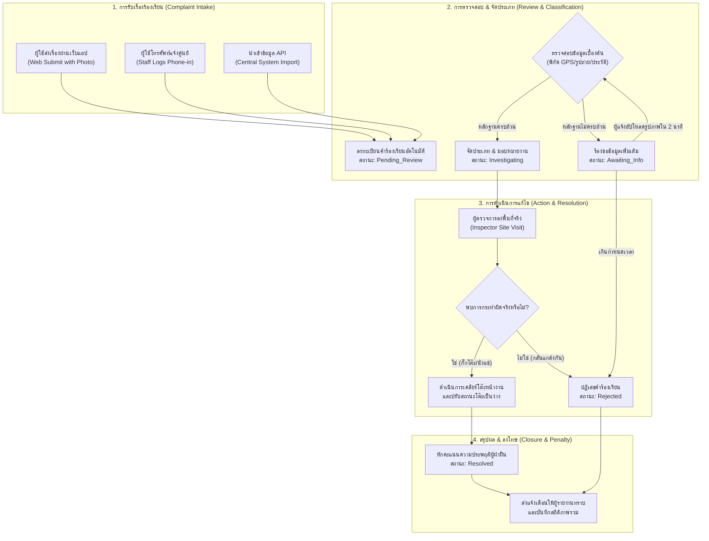

# แผนภาพและกระบวนการทำงานของระบบร้องเรียนและจัดการข้อขัดแย้ง (Complaint Workflow & Exceptions Design)

เอกสารฉบับนี้จัดทำขึ้นโดย Senior Full-stack Software Architect, Business Analyst และ Project Manager เพื่ออธิบายเวิร์กโฟลว์ (Workflow) การจัดการข้อร้องเรียน และระบบบริหารจัดการกรณีเกิดพฤติกรรมผิดปกติ (Exception Handling) ของ **ระบบจองโต๊ะโรงอาหารในสถานศึกษา (Canteen Table Booking System)** 

กระบวนการร้องเรียนนี้ประยุกต์มาจากโมเดลการรับเรื่องและคลี่คลายความขัดแย้งของศูนย์ดำรงธรรม โดยคำนึงถึงขอบเขตบทบาทหน้าที่ใน [03-roles-permissions.md](file:///d:/Table-Booking-System/docs/planning/03-roles-permissions.md) และความต้องการระบบจาก [02-requirements.md](file:///d:/Table-Booking-System/docs/planning/02-requirements.md)

---

## 1. เวิร์กโฟลว์การจัดการข้อร้องเรียน (Complaint Management Workflow)

กระบวนการจัดการเรื่องร้องเรียนแบ่งออกเป็น 5 ลำดับขั้นหลัก ตั้งแต่การนำข้อมูลเข้าระบบจนถึงการปิดประเด็นและลงโทษทางวินัยการใช้พื้นที่:



### รายละเอียดขั้นตอนการดำเนินงาน

1. **การรับเรื่องร้องเรียน (Complaint Intake):**
   * **Web Submission:** นักเรียน/อาจารย์ ที่ประสบปัญหาพบโต๊ะโดนกั๊กหรือโดนนั่งแช่ สามารถกดปุ่มร้องเรียนผ่านหน้า Seat Map ถ่ายภาพหลักฐานอัปโหลด และกดส่งทันที
   * **Phone-in logging:** กรณีโทรศัพท์ร้องเรียนเข้ามายังเบอร์เจ้าหน้าที่ แอดมินจะกรอกรายละเอียด หมายเลขโต๊ะ ข้อมูลผู้แจ้งและเป้าหมายลงฟอร์มหลังบ้านในฐานข้อมูล
   * **Central Integration:** ระบบดึงข้อมูลผ่าน Endpoint API ของระบบบริการของมหาวิทยาลัย/โรงเรียน ดึงคำร้องเรียนหมวดหมู่โรงอาหารเข้ามาประมวลผลอัตโนมัติ
2. **การตรวจสอบและคัดกรองเบื้องต้น (Initial Review):**
   * ระบบรับเรื่องและตั้งสถานะเริ่มต้นเป็น `รอยืนยันการรับเรื่อง (Pending_Review)` 
   * ระบบตรวจสอบความสอดคล้องอัตโนมัติ (เช่น โต๊ะที่ถูกร้องเรียนมีการจองทำงานอยู่หรือไม่ พิกัด GPS ของผู้แจ้งตรงกับตำแหน่งโรงอาหารจริงหรือไม่)
3. **การจัดประเภทและมอบหมายงาน (Classification & Investigation):**
   * กรณีข้อมูลหลักฐานภาพไม่ชัดเจน ระบบจะเปลี่ยนสถานะเป็น `รอข้อมูลเพิ่มเติม (Awaiting_Info)` และยิงแจ้งเตือนเตือนไปที่ผู้แจ้งให้เพิ่มรูปภาพเสริม
   * หากผ่านเกณฑ์ ระบบเปลี่ยนสถานะเป็น `กำลังตรวจสอบ (Investigating)` และส่งแจ้งเตือนข้อร้องเรียนไปยังวิทยุหน้าจอของ **ผู้ตรวจการโรงอาหาร (Canteen Inspector)** ที่เดินเวรอยู่ในพื้นที่ใกล้เคียงที่สุด
4. **การดำเนินการแก้ไข (Resolution Action):**
   * ผู้ตรวจการโรงอาหารลงตรวจสอบพิกัดโต๊ะจริงหน้างาน หากพบบุคคลกระทำผิด จะดำเนินการตักเตือน เชิญออกจากโต๊ะ หรือเก็บกวาดสัมภาระกั๊กที่นั่งส่งห้องประชาสัมพันธ์ พร้อมถ่ายภาพผลการเคลียร์
   * ปรับปรุงสถานะโต๊ะบนผังที่นั่งผ่านระบบแอปผู้ตรวจการให้กลับเป็น "ว่าง/รอทำความสะอาด"
5. **การปิดคำร้องและการลงโทษ (Closure & Penalty Logging):**
   * สารวัตรโรงอาหารกดปุ่มยืนยันผลการตัดสินในระบบ สถานะเปลี่ยนเป็น `ดำเนินการแก้ไขเสร็จสิ้น (Resolved)` 
   * ระบบคำนวณหักคะแนนความประพฤติผู้กระทำผิดจำนวน 20 คะแนนโดยอัตโนมัติ หากยอดคะแนนความประพฤติรวมลดลงต่ำกว่า 50 บัญชีผู้ใช้นั้นจะติดสถานะ **Blacklist** ห้ามจองทันที 7 วัน
   * ระบบส่งการแจ้งเตือนพุชไปยังผู้ร้องเรียนคนแรกว่า "โต๊ะได้รับการจัดการแก้ไขเรียบร้อยแล้ว" พร้อมแนบภาพประวัติสรุปการเคลียร์

---

## 2. สถานะของเรื่องร้องเรียนทั้งหมด (Complaint Status Lifecycle)

| รหัสสถานะ (Status Code) | ชื่อสถานะ (Thai Name) | คำอธิบายรายละเอียด | ผู้รับผิดชอบ (Role) | เงื่อนไขการเปลี่ยนสถานะ (Transitions) |
| :--- | :--- | :--- | :--- | :--- |
| **`Pending_Review`** | รอยืนยันการรับเรื่อง | ข้อร้องเรียนเพิ่งถูกส่งเข้ามาจากช่องทางใด ๆ รอการตรวจสอบความถูกต้องขั้นต้นของข้อมูล | *แอดมินระบบ / ระบบคัดกรองอัตโนมัติ* | <ul><li>เปลี่ยนไปเป็น **`Investigating`** เมื่อผ่านระบบสแกนภาพและยืนยันข้อมูลเบื้องต้น</li><li>เปลี่ยนไปเป็น **`Awaiting_Info`** หากรูปภาพเบลอหรือไม่ระบุเลขโต๊ะ</li></ul> |
| **`Awaiting_Info`** | รอข้อมูลเพิ่มเติม | หลักฐานภาพถ่ายไม่เพียงพอ หรือพิกัดคลาดเคลื่อน ระบบส่งสัญญาณขอนักศึกษาผู้แจ้งส่งข้อมูลอัปเดต | *นักศึกษาผู้แจ้ง* | <ul><li>เปลี่ยนไปเป็น **`Investigating`** เมื่อส่งหลักฐานเพิ่มสำเร็จในเวลาที่กำหนด</li><li>เปลี่ยนไปเป็น **`Rejected`** หากไม่มีการตอบกลับภายใน 2 นาที</li></ul> |
| **`Investigating`** | กำลังตรวจสอบข้อเท็จจริง | เรื่องร้องเรียนได้รับการจัดประเภท และมอบหมายให้สารวัตรโรงอาหารหน้างานเดินไปประเมินจุดเกิดเหตุ | *ผู้ตรวจการโรงอาหาร* | <ul><li>เปลี่ยนไปเป็น **`Resolved`** เมื่อสารวัตรเคลียร์พื้นที่และกดยืนยันการทำผิดกฎจริง</li><li>เปลี่ยนไปเป็น **`Rejected`** หากเดินทางไปถึงแล้วพบว่าเป็นเหตุเข้าใจผิด/กลั่นแกล้ง</li></ul> |
| **`Resolved`** | ดำเนินการเสร็จสิ้น | ปัญหาได้รับการจัดการ โต๊ะได้รับการเคลียร์ ผู้ผิดกฎได้รับการบันทึกโทษหักคะแนนประพฤติ | *ผู้ตรวจการโรงอาหาร / แอดมินระบบ* | *เป็นสถานะสิ้นสุดธุรกรรม (Final State)* |
| **`Rejected`** | ยกเลิก/ปฏิเสธคำร้อง | เรื่องร้องเรียนถูกพิจารณาว่าไม่มีมูลความจริง ข้อมูลเป็นขยะ หรือพิกัดอยู่นอกพื้นที่ทำงาน | *ผู้ตรวจการโรงอาหาร / แอดมินระบบ* | *เป็นสถานะสิ้นสุดธุรกรรม (Final State)* |

---

## 3. การรับมือกรณีทำงานผิดปกติของระบบ (Exception Handling / Edge Cases Design)

เพื่อรับประกันความแกร่งของระบบจองโต๊ะและป้องกันไม่ให้ระบบล่มหรือเกิดความสับสนเมื่อนำไปใช้งานจริง ได้มีการวิเคราะห์กรณีผิดปกติหลักและเสนอแนวทางแก้ไขระดับสถาปัตยกรรมดังนี้:

### 3.1 การแย่งจองโต๊ะเดียวกัน (Race Conditions / Double Booking)
* **ปัญหา:** นักศึกษา 2 คน กดจองโต๊ะตัวเดียวกันในเสี้ยววินาทีเดียวกัน ส่งผลให้ระบบอาจเกิดข้อผิดพลาดในการเปลี่ยนสถานะซ้อนทับ
* **แนวทางแก้ไขเชิงระบบ:**
  1. ใช้หลักการ **Pessimistic Locking** ในธุรกรรม MySQL ฐานข้อมูล
  2. เมื่อ Backend ได้รับคำขอจอง จะสั่งรัน SQL:
     ```sql
     START TRANSACTION;
     SELECT status FROM tables WHERE table_id = ? FOR UPDATE;
     ```
     *คำสั่ง `FOR UPDATE` จะบล็อก Request อื่น ๆ ที่จะพยายามอ่านหรือเขียนแถวนี้ทันที จนกว่า Transaction ปัจจุบันจะเสร็จสิ้น*
  3. หากสถานะเป็น `Available` ระบบจะรัน SQL อัปเดตการจองแล้วสั่ง `COMMIT`
  4. คำขอจองตัวที่สองที่รอคิวอยู่จะเห็นสถานะโต๊ะเปลี่ยนเป็น `Pending_Checkin` เรียบร้อยแล้ว จึงถูกยกเลิกคำขอกลับไปพร้อม HTTP Error `409 Conflict` (แจ้งผู้ใช้งานว่า "ขออภัย โต๊ะนี้เพิ่งได้รับการจองไปเมื่อครู่")

### 3.2 การนั่งผิดโต๊ะ หรือจองไม่ตรงประเภท (Wrong Sitting & Table Mismatch)
* **ปัญหา:** นักเรียนจองโต๊ะหมายเลข 01 แต่เดินไปนั่งที่โต๊ะหมายเลข 02 หรือนักเรียนแอบเข้าไปนั่งจองใน Reserved Staff Zone สำหรับอาจารย์
* **แนวทางแก้ไขเชิงระบบ:**
  - **สิทธิเข้าโซน:** ในโมดูลหลังบ้าน ระบบจะตรวจสอบฟิลด์ `Role` ของผู้ใช้ก่อนเริ่มทำคำขอจอง หากผู้ใช้ทั่วไปพยายามกดจองโต๊ะในโซนอาจารย์ ระบบจะส่งรหัสสิทธิ์ปฏิเสธ (403 Forbidden)
  - **เช็คอินคลาดเคลื่อน:** เมื่อนักเรียนเดินไปถึงโต๊ะและสแกน QR Code หาก QR Code ประจำโต๊ะที่สแกนไม่ตรงกับ `Table_ID` ที่จองไว้ ระบบจะแสดงข้อความแจ้งเตือนเตือน "คุณจองโต๊ะหมายเลข 01 ไว้ แต่รหัส QR ปัจจุบันคือโต๊ะหมายเลข 02 กรุณาเช็คอินให้ตรงโต๊ะ หรือกดสลับโต๊ะหากว่าง"

### 3.3 การเช็คอินไม่สำเร็จจากการระบุตำแหน่ง GPS ไม่ได้ (GPS Inaccuracy & Location Failure)
* **ปัญหา:** โทรศัพท์ไม่สามารถส่งข้อมูล GPS ที่มีตำแหน่งพิกัดแม่นยำได้เนื่องจากโครงสร้างหลังคาโรงอาหารทำด้วยเหล็กหนาหนาบดบังสัญญาณดาวเทียม (GPS Drift)
* **แนวทางแก้ไขเชิงระบบ:**
  * **ระดับที่ 1 (Retry & Guide):** ระบบแนะนำให้ผู้ใช้ปิด-เปิดสัญญาณ GPS ใหม่ หรือขยับอุปกรณ์เพื่อให้จับสัญญาณ และเปิดเช็คตำแหน่งอีกครั้ง
  * **ระดับที่ 2 (Fallback via Canteen Wi-Fi):** หาก GPS ยังทำงานไม่สำเร็จ Backend จะอนุญาตให้เช็คอินได้หากสมาร์ตโฟนผู้ใช้เชื่อมต่ออยู่กับ Access Point (SSID) ของมหาวิทยาลัย/โรงเรียนที่เป็นจุดกระจายสัญญาณในพื้นที่โรงอาหารโดยเฉพาะ (ตรวจจับผ่าน Gateway IP หรือ MAC Address)
  * **ระดับที่ 3 (Inspector Manual Override / QR Dynamic PIN):** หากไม่มีสัญญาณจริง ๆ ผู้ใช้สามารถยื่นหน้าจอนับถอยหลังการจองให้เจ้าหน้าที่แม่บ้านหรือผู้ตรวจการโรงอาหารที่ประจำจุดเพื่อสแกนบาร์โค้ดยืนยันตัวตนให้แบบแมนนวลผ่านสิทธิ์ของพนักงาน

### 3.4 พฤติกรรมการจองแล้วเบี้ยวจอง (No-Show Rules)
* **ปัญหา:** ผู้ใช้งานกดล็อกจองโต๊ะไว้เพื่อกั๊กสิทธิ์ แต่เปลี่ยนใจไม่ยอมเดินทางมาโรงอาหาร และปล่อยให้สิทธิ์จองค้างไว้ทำให้ผู้อื่นเสียโอกาส
* **แนวทางแก้ไขเชิงระบบ:**
  1. ระบบหลังบ้านมีบริการ **Cron Job Service** ทำงานในลักษณะวนลูปตรวจสอบตารางฐานข้อมูลทุก ๆ 60 วินาที
  2. สแกนตรวจสอบรายการในตาราง `bookings` ที่มี `Booking_Status = 'Pending'` และเวลาปัจจุบันมีค่ามากกว่า `Booked_At + 10 Minutes` (หมด Grace Period)
  3. สั่งอัปเดตยกเลิกสิทธิ์จองโดยอัตโนมัติ:
     ```sql
     UPDATE bookings SET Booking_Status = 'Expired' WHERE Booking_ID = ?;
     UPDATE tables SET status = 'Available' WHERE Table_ID = ?;
     ```
  4. บันทึกลงตาราง Penalty Logs หักคะแนนความประพฤติผู้ใช้งานคนดังกล่าว 5 คะแนน และส่งแจ้งเตือนแจ้งผลการหักแต้ม

### 3.5 ปัญหานั่งแช่เกินเวลา (Overstaying / Squatting Tables)
* **ปัญหา:** นักเรียนรับประทานอาหารเสร็จแล้วแต่ไม่ยอมกดปุ่มเช็คเอาต์ และนั่งคุยงานต่อจนเกินเวลาโควตา 30-45 นาที
* **แนวทางแก้ไขเชิงระบบ:**
  - **เตือนล่วงหน้า:** ก่อนครบกำหนดเวลาจอง 5 นาที ระบบส่งการแจ้งเตือนพุชไปยังผู้ใช้ "เวลาใช้งานของคุณเหลืออีก 5 นาที กรุณาเตรียมตัวคืนพื้นที่โต๊ะ"
  - **หมดสิทธิ์อัตโนมัติ:** เมื่อครบ 30 นาทีของการเช็คอินจริง สถานะการครองจองในระบบจะเปลี่ยนเป็น `Completed` และสถานะโต๊ะบนผังที่นั่งอัปเดตกลับไปเป็นว่าง (Available)
  - **การจัดการคิวถัดไป:** หากคิวต่อไปเดินมาถึงโต๊ะแล้วพบว่าเจ้าของคนเก่ายังคงนั่งอยู่ สามารถกดปุ่ม **"ร้องเรียนการนั่งแช่ ณ โต๊ะจริง"** ระบบจะส่งการแจ้งเตือนพุชเตือนไปยังผู้ใช้คนเดิมให้นำสิ่งของออก และยิงสัญญาณประสานงานด่วนให้สารวัตรโรงอาหารหน้างานเดินมาตักเตือน หากผู้กระทำผิดยังไม่เพิกเฉยจะถูกผู้ตรวจการกดหักคะแนนความประพฤติทันที 20 คะแนน

---
*เอกสารนี้จัดทำตามกฎระเบียบและข้อกำหนดการพัฒนาโครงการระบบจองโต๊ะโรงอาหารในสถานศึกษา*
*สเต็ปถัดไปในการวางแผนระบบคือการออกแบบฐานข้อมูลแบบ Relational Database ใน [05-database-design.md](file:///d:/Table-Booking-System/docs/planning/05-database-design.md)*
