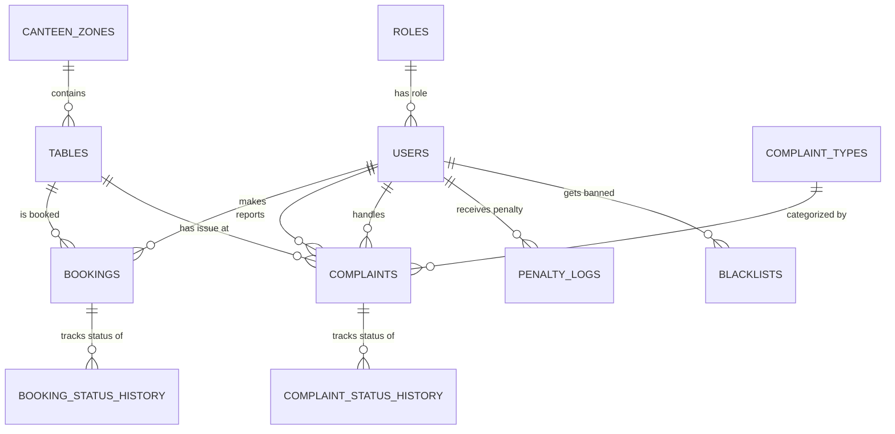

# การออกแบบสถาปัตยกรรมฐานข้อมูล (Database Schema Design Overview)

เอกสารฉบับนี้จัดทำขึ้นโดย Senior Database Architect และ Backend Architect เพื่อเสนอการออกแบบโครงสร้างฐานข้อมูลเชิงสัมพันธ์ (Relational Database Design) สำหรับ **ระบบจองโต๊ะโรงอาหารในสถานศึกษา (Canteen Table Booking System)** 

สเปกฐานข้อมูลนี้พัฒนาโดยใช้ **MySQL 8** เป็นระบบฐานข้อมูลหลัก โดยการตั้งชื่อตารางและฟิลด์เป็นภาษาอังกฤษรูปแบบ `snake_case` ตามข้อตกลง โครงสร้างนี้ออกแบบมาเพื่อรองรับข้อกำหนดจาก [02-requirements.md](file:///d:/Table-Booking-System/docs/planning/02-requirements.md) และสิทธิเข้าถึงใน [03-roles-permissions.md](file:///d:/Table-Booking-System/docs/planning/03-roles-permissions.md) รวมถึงประวัติเวิร์กโฟลว์ตาม [04-complaint-workflow.md](file:///d:/Table-Booking-System/docs/planning/04-complaint-workflow.md)

---

## 1. ผังความสัมพันธ์ของข้อมูล (Entity Relationship Diagram Concept)

แผนผังแสดงความสัมพันธ์ของตารางหลัก ๆ ภายในระบบจองโต๊ะโรงอาหารและเรื่องร้องเรียน:

---

## 2. กลุ่มตารางข้อมูลหลัก (Master Data Tables)

ตารางข้อมูลหลักที่ใช้เป็นข้อมูลอ้างอิงของระบบ มีการเปลี่ยนแปลงความถี่ต่ำ:

### 2.1 ตารางบทบาทสิทธิ์ (roles)
* **วัตถุประสงค์:** เก็บบทบาทสิทธิ์การใช้งานระบบเพื่อความยืดหยุ่นในการขยายระบบในอนาคต (เช่น เพิ่มบทบาทร้านค้า หรือฝ่ายบริหาร)
* **Field สำคัญ:**
  * `id` (INT UNSIGNED, PK)
  * `role_name` (VARCHAR, UNIQUE) — เช่น `student`, `staff`, `cleaner`, `inspector`, `admin`, `executive`
  * `description` (VARCHAR)

### 2.2 ตารางข้อมูลผู้ใช้งาน (users)
* **วัตถุประสงค์:** เก็บข้อมูลผู้จอง, แอดมิน, สารวัตรนักเรียน และแม่บ้านประจำโรงอาหาร
* **Field สำคัญ:**
  * `id` (INT UNSIGNED, PK)
  * `username` (VARCHAR, UNIQUE)
  * `password_hash` (VARCHAR) — รหัสผ่านที่เข้ารหัสลับด้วย bcrypt
  * `email` (VARCHAR, UNIQUE)
  * `first_name` (VARCHAR)
  * `last_name` (VARCHAR)
  * `student_id` (VARCHAR, UNIQUE, NULLABLE) — เก็บเฉพาะนักเรียน/บุคลากร
  * `role_id` (INT UNSIGNED, FK -> `roles.id`)
  * `penalty_points` (INT) — คะแนนประพฤติ (เริ่มต้น 100)
  * `is_blacklisted` (TINYINT) — สถานะการบล็อกสิทธิ์จองล่วงหน้า (0 = ปกติ, 1 = โดนแบน)

### 2.3 ตารางโซนโรงอาหาร (canteen_zones)
* **วัตถุประสงค์:** จัดกลุ่มโซนโต๊ะอาหารเพื่อบริหารจัดการและกำหนดสิทธิ์เข้าใช้โซนเฉพาะ
* **Field สำคัญ:**
  * `id` (INT UNSIGNED, PK)
  * `zone_name` (VARCHAR, UNIQUE) — เช่น `Zone A`, `Reserved Staff Zone`
  * `is_staff_only` (TINYINT) — ตรวจสอบสิทธิ์สำหรับอาจารย์/บุคลากรเท่านั้น

### 2.4 ตารางข้อมูลโต๊ะอาหาร (tables)
* **วัตถุประสงค์:** เก็บรายละเอียดข้อมูลพิกัดโต๊ะ สถานะปัจจุบัน และรหัสสำหรับการเช็คอิน
* **Field สำคัญ:**
  * `id` (INT UNSIGNED, PK)
  * `table_number` (VARCHAR)
  * `zone_id` (INT UNSIGNED, FK -> `canteen_zones.id`)
  * `layout_x` (INT) / `layout_y` (INT) — พิกัดสำหรับแสดงผลแผนผัง 2 มิติหน้าบ้าน
  * `qr_code_hash` (VARCHAR, UNIQUE) — ค่าแฮชที่พิมพ์บนสติกเกอร์ QR Code ประจำโต๊ะ
  * `status` (ENUM) — สถานะโต๊ะ (`available`, `pending_checkin`, `occupied`, `need_cleaning`, `cleaning`, `maintenance`)

### 2.5 ตารางประเภทข้อร้องเรียน (complaint_types)
* **วัตถุประสงค์:** กำหนดหมวดหมู่เรื่องร้องเรียนและระดับคะแนนความผิดมาตรฐาน
* **Field สำคัญ:**
  * `id` (INT UNSIGNED, PK)
  * `type_name` (VARCHAR) — เช่น `table_hogging`, `overstay`, `table_damage`, `hygiene`
  * `default_penalty_points` (INT) — คะแนนที่จะถูกหักโดยอัตโนมัติหากตรวจสอบพบว่าผิดจริง (เช่น 20 คะแนน)

---

## 3. กลุ่มตารางบันทึกธุรกรรม (Transaction Tables)

ตารางบันทึกการกระทำและรายการเปลี่ยนแปลงแบบไดนามิกที่มีปริมาณข้อมูลเพิ่มขึ้นตามการใช้จริง:

### 3.1 ตารางข้อมูลการจองโต๊ะ (bookings)
* **วัตถุประสงค์:** บันทึกข้อมูลการจอง เวลาเช็คอิน เช็คเอาต์ และสถานะธุรกรรมการครองสิทธิ์โต๊ะ
* **Field สำคัญ:**
  * `id` (INT UNSIGNED, PK)
  * `user_id` (INT UNSIGNED, FK -> `users.id`) — ผู้จอง
  * `table_id` (INT UNSIGNED, FK -> `tables.id`) — โต๊ะที่จอง
  * `booked_at` (TIMESTAMP) — เวลาที่กดจอง
  * `grace_expired_at` (TIMESTAMP) — เส้นตายเวลาที่ต้องไปเช็คอิน (booked_at + 10 นาที)
  * `checked_in_at` (TIMESTAMP, NULLABLE) — เวลาเช็คอินจริง
  * `checked_out_at` (TIMESTAMP, NULLABLE) — เวลาเช็คเอาต์หรือยกเลิกสิทธิ์
  * `expected_end_at` (TIMESTAMP, NULLABLE) — เวลาสิ้นสุดสิทธิ์การจองที่คำนวณไว้ (เช็คอิน + 30 นาที)
  * `status` (ENUM) — (`pending`, `active`, `completed`, `expired`, `cancelled`)

### 3.2 ตารางข้อมูลข้อร้องเรียน (complaints)
* **วัตถุประสงค์:** บันทึกการส่งเรื่องร้องเรียนความขัดแย้งของที่นั่งจากช่องทางต่าง ๆ และผลลัพธ์
* **Field สำคัญ:**
  * `id` (INT UNSIGNED, PK)
  * `source` (ENUM) — ช่องทางนำเข้า (`web`, `phone`, `central_api`)
  * `reporter_user_id` (INT UNSIGNED, FK -> `users.id`, NULLABLE) — ผู้แจ้ง (NULL หากไม่ประสงค์ออกนาม)
  * `receiver_admin_id` (INT UNSIGNED, FK -> `users.id`, NULLABLE) — แอดมินผู้รับสายบันทึกข้อมูลทางโทรศัพท์
  * `table_id` (INT UNSIGNED, FK -> `tables.id`) — โต๊ะที่ถูกแจ้งปัญหา
  * `complaint_type_id` (INT UNSIGNED, FK -> `complaint_types.id`) — ประเภทของปัญหา
  * `evidence_image_path` (VARCHAR, NULLABLE) — ลิงก์ที่อยู่ไฟล์ภาพพยานหลักฐาน
  * `description` (TEXT) — รายละเอียดข้อความร้องเรียน
  * `status` (ENUM) — (`pending_review`, `awaiting_info`, `investigating`, `resolved`, `rejected`)
  * `created_at` (TIMESTAMP)
  * `resolved_at` (TIMESTAMP, NULLABLE)

### 3.3 ตารางบัญชีรายชื่อระงับสิทธิ์ (blacklists)
* **วัตถุประสงค์:** บันทึกข้อมูลประวัติผู้ใช้ที่ถูกล็อกสิทธิ์การจองเนื่องจากทำผิดกฎบ่อยครั้ง
* **Field สำคัญ:**
  * `id` (INT UNSIGNED, PK)
  * `user_id` (INT UNSIGNED, FK -> `users.id`) — บัญชีที่ถูกแบน
  * `banned_at` (TIMESTAMP) — วันเวลาเริ่มต้นแบน
  * `banned_until` (TIMESTAMP) — วันเวลาสิ้นสุดการแบน (อัตโนมัติ 7 วัน)
  * `reason` (VARCHAR) — เหตุผลในการแบน
  * `created_by_admin_id` (INT UNSIGNED, FK -> `users.id`) — แอดมินผู้ดำเนินการแบน (ในกรณี Manual Ban)
  * `is_active` (TINYINT) — สถานะการแบนปัจจุบัน (0 = สิ้นสุดการลงโทษ, 1 = ยังโดนแบนอยู่)

---

## 4. กลุ่มตารางบันทึกประวัติและการเปลี่ยนสถานะ (Log/History Tables)

ตารางประวัติสำหรับเก็บร่องรอยการตรวจสอบ (Audit Trail) การขยายระบบ และการติดตามกระบวนการทำงานย้อนหลัง:

### 4.1 ตารางประวัติสถานะการจองโต๊ะ (booking_status_history)
* **วัตถุประสงค์:** เก็บร่องรอยประวัติทุกสถานะของการจองเพื่อใช้ตรวจจับพฤติกรรมย้อนหลัง
* **Field สำคัญ:**
  * `id` (BIGINT UNSIGNED, PK)
  * `booking_id` (INT UNSIGNED, FK -> `bookings.id`)
  * `old_status` (ENUM, NULLABLE)
  * `new_status` (ENUM)
  * `changed_at` (TIMESTAMP)
  * `changed_by_user_id` (INT UNSIGNED, FK -> `users.id`, NULLABLE) — บัญชีผู้ใช้ที่ทำให้เปลี่ยนสถานะ (NULL = ปรับเปลี่ยนโดย Cron Job/System)

### 4.2 ตารางประวัติสถานะเรื่องร้องเรียน (complaint_status_history)
* **วัตถุประสงค์:** ติดตามประวัติการประสานงาน ปัญหา และการตัดสินข้อร้องเรียนของสารวัตรโรงอาหาร
* **Field สำคัญ:**
  * `id` (BIGINT UNSIGNED, PK)
  * `complaint_id` (INT UNSIGNED, FK -> `complaints.id`)
  * `old_status` (ENUM, NULLABLE)
  * `new_status` (ENUM)
  * `remarks` (TEXT, NULLABLE) — ข้อบันทึกคำสั่งการและเหตุผลของสารวัตรโรงอาหารหน้างาน
  * `changed_at` (TIMESTAMP)
  * `changed_by_user_id` (INT UNSIGNED, FK -> `users.id`) — สารวัตรนักเรียนหรือแอดมินระบบที่กดยืนยันสถานะ

### 4.3 ตารางประวัติการหักคะแนนความประพฤติ (penalty_logs)
* **วัตถุประสงค์:** บันทึกที่มาการเปลี่ยนแปลงคะแนนประพฤติทุกครั้งเพื่อความโปร่งใส ป้องกันแอดมินทุจริตหักคะแนนส่วนตัว
* **Field สำคัญ:**
  * `id` (INT UNSIGNED, PK)
  * `user_id` (INT UNSIGNED, FK -> `users.id`) — บัญชีผู้โดนหัก/คืนแต้ม
  * `booking_id` (INT UNSIGNED, FK -> `bookings.id`, NULLABLE) — ระบุการจองที่เป็นเหตุ (เช่น ปล่อยจองหมดอายุ)
  * `complaint_id` (INT UNSIGNED, FK -> `complaints.id`, NULLABLE) — ระบุเคสร้องเรียนที่เป็นเหตุ (เช่น โดนจับได้ว่ากั๊กโต๊ะ)
  * `points_changed` (INT) — จำนวนคะแนนที่เปลี่ยนแปลง (เช่น -5, -20, +10)
  * `action_type` (ENUM) — ประเภทธุรกรรม (`deduct`, `restore`)
  * `reason` (VARCHAR)
  * `created_at` (TIMESTAMP)
  * `created_by_user_id` (INT UNSIGNED, FK -> `users.id`, NULLABLE) — NULL = ลงแต้มอัตโนมัติโดยระบบ

### 4.4 ตารางประวัติทำความสะอาดโต๊ะ (table_cleaning_logs)
* **วัตถุประสงค์:** ตรวจจับประสิทธิภาพการทำงานและเก็บข้อมูลความเร็วในการดูแลความสะอาดโต๊ะของแม่บ้าน
* **Field สำคัญ:**
  * `id` (INT UNSIGNED, PK)
  * `table_id` (INT UNSIGNED, FK -> `tables.id`)
  * `cleaner_user_id` (INT UNSIGNED, FK -> `users.id`) — แม่บ้านที่รับงาน
  * `started_at` (TIMESTAMP) — เวลาที่เปลี่ยนโต๊ะเป็น Cleaning
  * `completed_at` (TIMESTAMP) — เวลาเช็ดโต๊ะเสร็จอัปเดตกลับเป็น Available

---

## 5. การวิเคราะห์ดัชนีและการขยายระบบในอนาคต (Indexing & Future Scalability)

> [!TIP]
> **การทำ Database Indexing สำหรับรองรับ Peak Load:**
> 1. **`tables.status`:** โรงอาหารที่มีโต๊ะเยอะ หน้าแรกจะสแกนหาเฉพาะโต๊ะที่ว่าง (`status = 'available'`) บ่อยมาก การตั้งดัชนี (Index) ที่คอลัมน์ `status` คู่กับ `zone_id` จะช่วยให้การทำ Query แผนผัง Seat Map รวดเร็วขึ้นอย่างมาก
> 2. **`bookings.user_id` + `status`:** การควบคุมกฎจำกัด 1 สิทธิ์การจองของนักศึกษา จะต้องถูกตรวจสอบทุกครั้งที่มีการกดจองใหม่ โดยโปรแกรมหลังบ้านจะเช็คความว่างด้วยคอลัมน์นี้ ดัชนีแบบ Composite Index บนคอลัมน์ `(user_id, status)` จะช่วยเร่งกระบวนการคัดกรองนี้ก่อนทำ Pessimistic Locking
> 3. **`bookings.grace_expired_at` + `status`:** ช่วยเพิ่มความเร็วให้แก่ Auto-Release Cron Service ที่ทำงานทุกนาทีในการสแกนหาการจองที่หมดเวลา

---

## 6. มาตรการและการออกแบบเพื่อความปลอดภัยของข้อมูลส่วนบุคคล (PII & PDPA Protection)

การจัดเก็บข้อมูลในระบบจองโต๊ะและการร้องเรียนนี้ มีจุดเสี่ยงทางกฎหมายคุ้มครองข้อมูลส่วนบุคคล (PDPA) สถาปัตยกรรมฐานข้อมูลนี้จึงวางแผนมาตรการป้องกันไว้ดังนี้:

1. **ระบบทำลายพิกัด GPS อัตโนมัติ (Ephemeral GPS Data):**
   * ข้อมูลพิกัดละติจูดและลองจิจูดของสมาร์ตโฟนผู้จองที่ส่งมาตอนเช็คอิน จะทำหน้าที่เปรียบเทียบในเลเยอร์ Logic (หลังบ้าน) เพื่อตรวจสอบขอบเขตโรงอาหารเท่านั้น
   * **ห้ามบันทึกพิกัด GPS จริงลงในตาราง `bookings` ของฐานข้อมูลอย่างถาวร** (เพื่อป้องกันการแอบดึงฐานข้อมูลไปสะกดรอยตามที่อยู่ผู้ใช้อื่น)
2. **การปกปิดข้อมูลผู้แจ้งเรื่องร้องเรียน (Anonymization Policy):**
   * ในฟิลด์ `reporter_user_id` ในตาราง `complaints` จะกำหนดสิทธิ์ให้บันทึกเป็น `NULL` ได้ หากผู้แจ้งกดเลือกโหมด "ไม่ประสงค์ออกนาม (Anonymous Report)" เพื่อความปลอดภัยของผู้ส่งรายงานป้องกันการโดนล้างแค้นหรือคุกคามในภายหลัง
3. **กำหนดการล้างไฟล์พยานหลักฐาน (Storage Retention Cleanup):**
   * ภาพถ่ายหลักฐานในการทำความผิดกั๊กโต๊ะ (ตาราง `complaints.evidence_image_path`) มักติดใบหน้าของนักศึกษาคนอื่น ระบบฐานข้อมูลควรมีนโยบายล้างประวัติ URL รูปภาพและลบไฟล์ภาพออกจากคลาวด์จัดเก็บทันทีหลังจากสถานะถูกปรับเป็น `Resolved` หรือ `Rejected` เกิน 30 วันเป็นต้นไป

---
*เอกสารนี้จัดทำตามกฎระเบียบและข้อกำหนดการพัฒนาโครงการระบบจองโต๊ะโรงอาหารในสถานศึกษา*
*สเต็ปถัดไปในการสร้างเอกสารวิเคราะห์ระบบคือการทำข้อตกลง API Contract ใน [06-api-contract.md](file:///d:/Table-Booking-System/docs/planning/06-api-contract.md)*
